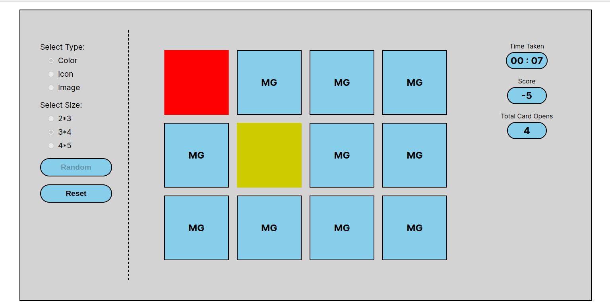
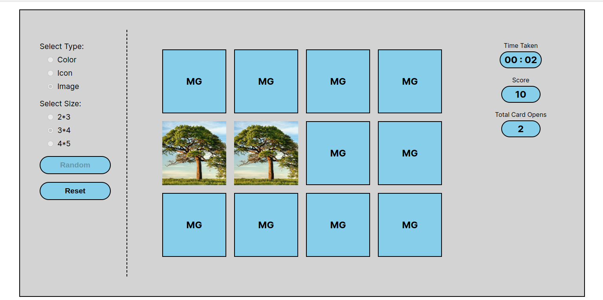

# Review Task: Memory Game

### Technology : Angular

### Features:
- Initially, All Card Faced Down
- When the User Click On Any Card, It Will Face Up And the User Can Read the Data/Image On That Card
- Maximum grid size is: 5*4 = 20 (Total 10 pairs)
- Take 15 different Colour, Icons, and images. Every time display any random 10 pairs. (In the case of 5*4)
- User Can Open Maximum 2 Cards. If Both Cards Are Unmatched Then After 1 Second Both Card Closed
- If Both Cards Are Matched Then Both Card Will Be Open And Disabled
- Click on the Random button will be chosen a random game. Users can change the type and size.
- If the game is completed then display a congratulations message.

### Preview:

